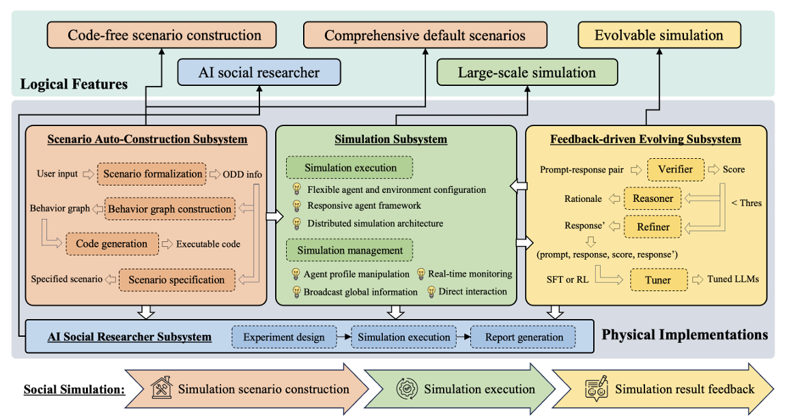

# Technical Architecture

Overview of YuLan-OneSim's system architecture and technology stack.

## System architecture

### Scenario Auto-Construction Subsystem
- **Function**: Converts natural language descriptions into executable simulation code.
- **Key Components**:
  - **ODD Protocol Translator**: Uses the Overview, Design Concepts, and Details (ODD) protocol for formalizing simulation models.
  - **Behavior Graph Construction**: Models agent behaviors and decision-making logic via a structured graph.
  - **Code Generation Engine**: Automatically generates simulation code based on user input.
- **User Interface**: Allows users to define scenarios using natural language prompts or templates.

### Simulation Subsystem
- **Function**: Executes and manages large-scale simulations with real-time monitoring.
- **Architecture**:
  - **Fully Responsive Agent Framework**: Enables dynamic, event-driven interactions between agents and environments.
  - **Distributed Master-Worker Architecture**: Scales up to 100,000 agents by distributing computational load across multiple nodes while maintaining global consistency.
  - **Simulation Execution Engine**: Manages agent actions, environment updates, and interaction logic.
- **Features**:
  - Real-time visualization of simulation events.
  - Flexible configuration of agent profiles, population sizes, and environmental parameters.
  
### Feedback-Driven Evolving Subsystem
- **Function**: Improves simulation realism through feedback integration (from AI or humans).
- **Framework**:
  - **VR²T Framework (Verifier–Reasoner–Refiner–Tuner)**: A multi-agent mechanism that evaluates simulation results, identifies issues, and fine-tunes the LLM backbone.
  - Supports both **automated error correction** and **human-in-the-loop refinement**.
- **Goal**: Ensures continuous improvement and alignment with expected behavioral patterns. 

### AI Social Researcher Subsystem
- **Function**: Automates the end-to-end social science research process.
- **Modules**:
  - **Experiment Design Module**: Formulates hypotheses, selects scenarios, and configures simulations.
  - **Report Generation Module**: Analyzes simulation outputs and generates technical reports in LaTeX format.
- **Workflow**:
  1. User inputs a research topic.
  2. The AI researcher formulates questions, designs simulations, runs them, and interprets results.
  3. Generates structured reports with visualizations, analysis, and conclusions.