# Custom Scenario Development

While YuLan-OneSim offers many built-in scenarios, you can also create your own to explore specific research questions. The platform provides a highly customizable, step-by-step design process to transform your ideas into a runnable simulation.

## The Development Process

Creating a new scenario is a guided process within the YuLan-OneSim Web UI. Here's how it works:

### Step 1: Describe Your Scenario with Natural Language

The first step is to describe your research goal in natural language. What social phenomenon do you want to model? What are the key interactions and expected outcomes? A clear description is crucial, as the system uses it to generate the initial components of your scenario.

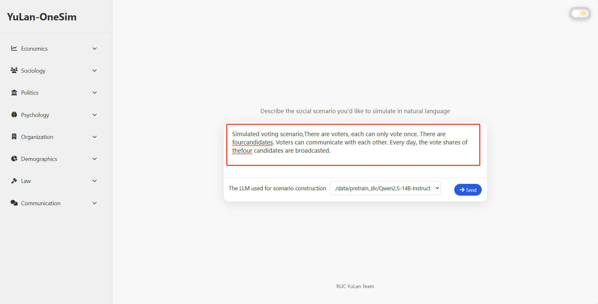

You can also provide additional context or reference materials to refine the scenario design.

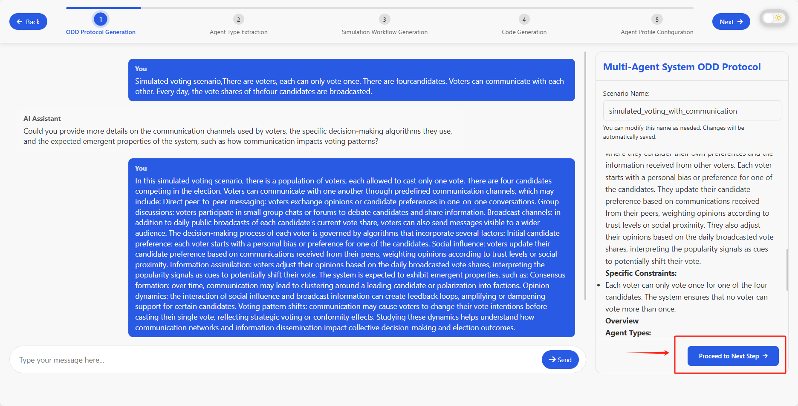

### Step 2: Define and Refine Agent Types

Based on your description, the system will propose a set of agent types for your simulation. You have full control to add, remove, or modify these agent types to ensure they accurately represent the actors in your scenario.

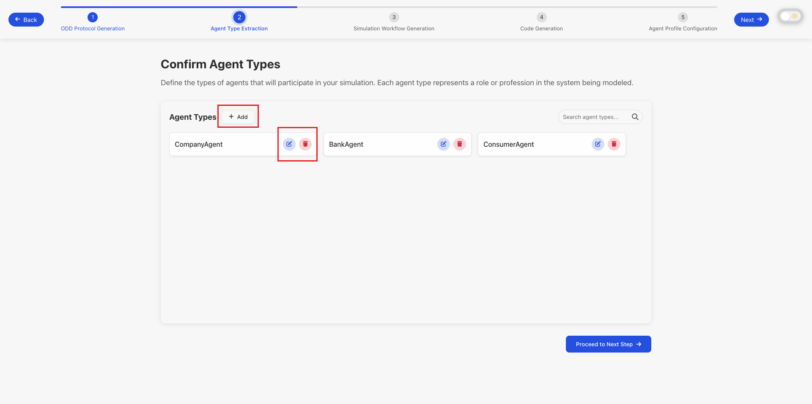

### Step 3: Design the Behavior Graph

The behavior of agents is modeled using an interactive behavior graph. This graph visually represents the states an agent can be in and the actions that transition them between states. You can:

- **Add, remove, or modify nodes and edges** to build the logic flow.
- **Click on any node or edge** to edit its detailed properties, such as the conditions for a transition or the actions an agent performs in a particular state.

This high level of customization ensures that your agents act in a way that is consistent with your research goals.

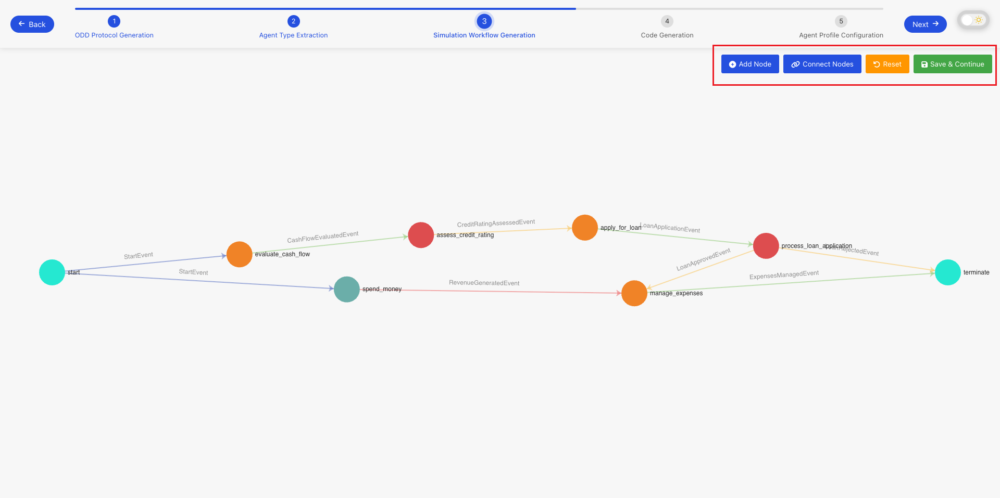
*Modifying the behavior graph.*

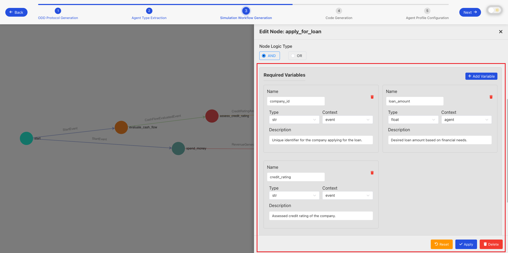
*Editing the details of a specific node.*

### Step 4: Generate and Review Code

Once you are satisfied with the behavior graph, the system will automatically generate the corresponding Python code. You can click on any node or edge in the graph to view the specific code snippet that implements its logic. This transparency allows you to understand and verify the implementation details.

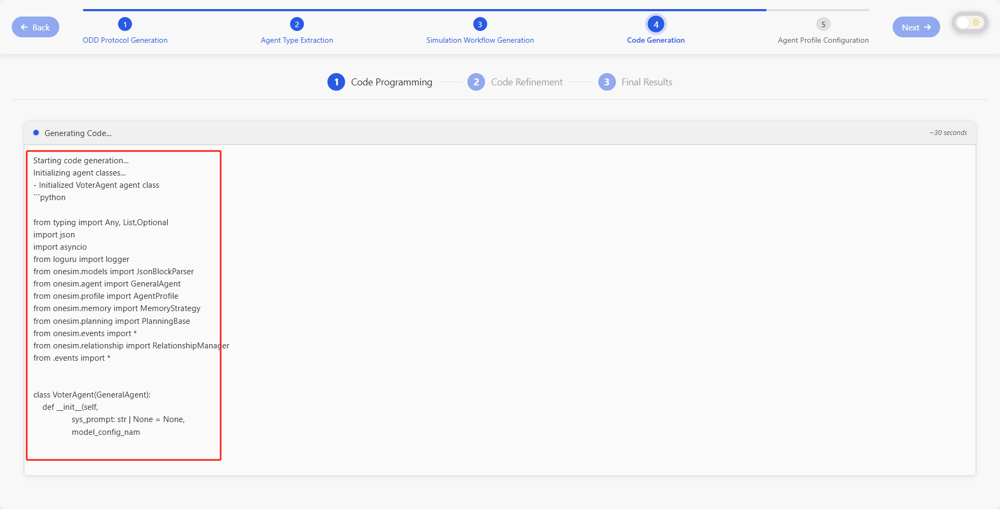
*Code generation is in progress.*

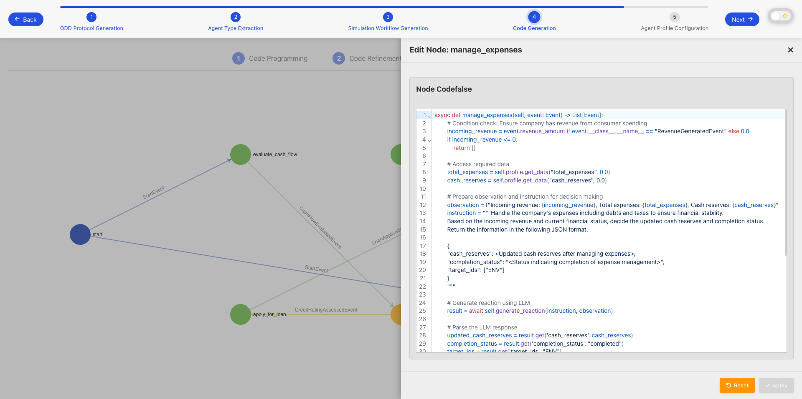
*Reviewing the generated code for a specific part of the behavior graph.*

### Step 5: Configure Agent Profiles

Next, you define the attributes and initial data for your agents. You can:

- **Add, remove, or modify agent attributes** (e.g., age, income, beliefs).
- **Set the number of profiles** to generate for each agent type.

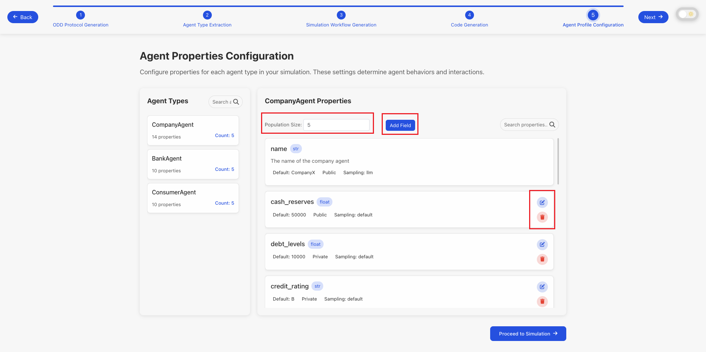
*Configuring agent attributes.*

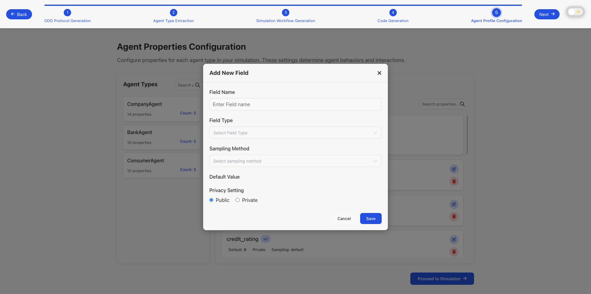
*Adding new attributes for an agent type.*

**How to use custom data**: You can provide your own data by replacing the contents of the `profile` folder under the scenario directory. This allows you to use **real-world** data or your custom datasets instead of the automatically generated profiles. Simply replace the JSON files in the `profile/data/` directory with your own agent data that follows the same schema structure. 

### Step 6: Configure Runtime Settings and Launch

The final step is to configure the simulation's runtime settings. This includes parameters such as:

- **Simulation Configuration**: The number of cycles the simulation will run.
- **Agent Configuration**: The number of agents in the simulation, along with their memory and planning strategies.
- **LLM Configuration**: Which language models to use for agent decision-making.

After configuring these settings, you are ready to launch your simulation!

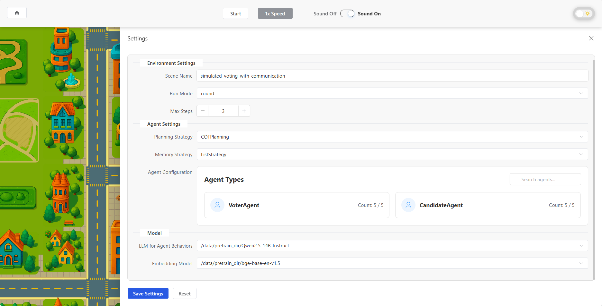
*Configuring runtime settings.*

Once the simulation starts, you can monitor its progress, view events, and analyze the results in the simulation console.

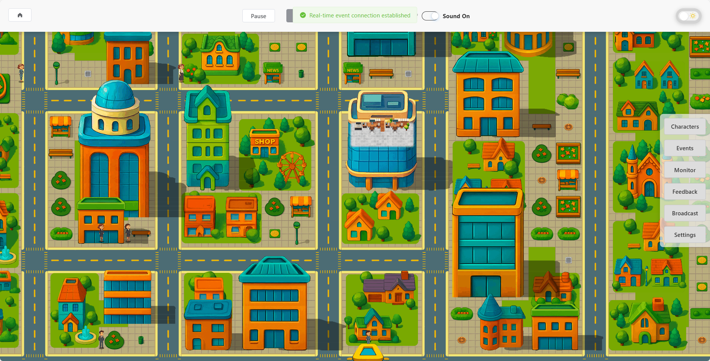
*The simulation is running.*
